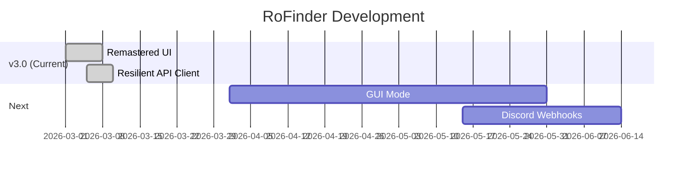

<div align="center">

# RoFinder v3


<p align="center">
  
</p>

<p align="center">
  <a href="https://github.com/osfv/rofinder/releases">
    
  </a>
  <a href="https://github.com/osfv/rofinder/stargazers">
    
  </a>
  <a href="https://github.com/osfv/rofinder/blob/main/LICENSE">
    
  </a>
  <a href="https://github.com/osfv/rofinder/commits/main">
    
  </a>
</p>

<p align="center">
  
  
  
</p>

<p align="center">
  <a href="#installation"><kbd> <br> Installation <br> </kbd></a>&ensp;&ensp;
  <a href="#usage"><kbd> <br> Usage <br> </kbd></a>&ensp;&ensp;
  <a href="#features"><kbd> <br> Features <br> </kbd></a>&ensp;&ensp;
  <a href="#exporting"><kbd> <br> Exporting <br> </kbd></a>
</p>

</div>

<br>

## About RoFinder v3

RoFinder v3 is a full rebuild of the original CLI into a faster, cleaner intelligence suite for Roblox OSINT work. The API client now includes retries, pagination, and lightweight caching for better reliability, while the UI shifts to a neon dashboard layout with animated boot and section headers.

Exports are available in JSON, TXT, and Markdown to cover developer workflows and shareable reports.

<br>

## Features

- Resilient API client (retries, pagination, caching)
- Remastered neon dashboard layout with animated intro
- Sectioned intelligence: profile, presence, avatar, friends, favorites, badges, groups
- Export reports to JSON, TXT, or Markdown
- Backwards-compatible flags for v2 users

<br>

## Installation

<div align="center">

### 1. Clone the Repository
```bash
git clone https://github.com/osfv/rofinder.git
cd rofinder
```

### 2. Install Dependencies
```bash
pip install -r requirements.txt
```

### 3. Run RoFinder
```bash
python rofinder.py --help
```

</div>

<br>

## Usage

<div align="center">

### Quick Summary
```bash
python rofinder.py roblox
```

### Full Intelligence Sweep
```bash
python rofinder.py roblox --full
```

### Custom Sections
```bash
python rofinder.py roblox --sections profile,stats,presence,badges,groups
```

### Avatar Forensics Only
```bash
python rofinder.py roblox --avatar
```

### Save JSON Report
```bash
python rofinder.py roblox --full --save report.json --format json
```

### Save Markdown Report
```bash
python rofinder.py roblox --full --save report.md --format md
```

### Disable Animations
```bash
python rofinder.py roblox --no-anim
```

### Monochrome Theme
```bash
python rofinder.py roblox --theme mono
```

</div>

<br>

## Exporting

RoFinder can generate developer-friendly JSON exports or clean TXT/Markdown reports for sharing and archiving.

<br>

## Roadmap

<div align="center">



</div>

<br>

## License

<div align="center">

This project is licensed under the **MIT License**.

Copyright (c) 2026 **osfv**

</div>
