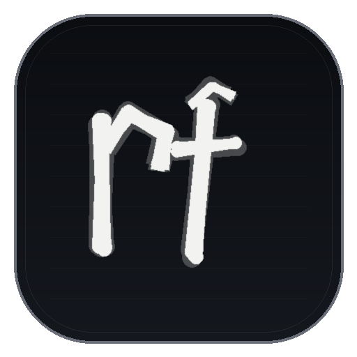

# RoFinder v3

<div align="center">
  

  <h3>Fast Roblox profile intelligence from your terminal.</h3>

  <p>
    Resolve a Roblox username or user ID, collect public account intelligence,
    inspect optional sections, and export clean reports.
  </p>

  <p>
    
    
    
  </p>

  <p>
    <a href="#quick-start">Quick Start</a> ·
    <a href="#usage">Usage</a> ·
    <a href="#sections">Sections</a> ·
    <a href="#exports">Exports</a>
  </p>
</div>

## What It Does

RoFinder is a Roblox OSINT CLI for quick, structured checks on public Roblox accounts. It resolves a target, pulls profile data, and can expand into network stats, presence, avatar assets, friends, favorite games, badges, and groups.

No login. No cookies. No private account access. RoFinder only works with public data available through Roblox-compatible APIs.

## Features

| Capability | Details |
| --- | --- |
| Account resolution | Accepts usernames or numeric Roblox user IDs |
| Profile intelligence | Username, display name, user ID, creation date, ban status, verified badge |
| Network stats | Friends, followers, and following counts |
| Presence checks | Online state, last location, and premium signal when available |
| Avatar inspection | Headshot URL plus currently worn assets |
| Optional sections | Friends, favorite games, badges, groups, and custom section selection |
| Report exports | JSON for tooling, TXT for readable reports, Markdown for notes or sharing |
| API flexibility | Defaults to `roproxy`, with direct Roblox API support available |

## Quick Start

```bash
git clone https://github.com/osfv/rofinder.git
cd rofinder
python -m pip install -r requirements.txt
python rofinder.py roblox
```

Requires Python 3.8+.

## Usage

```bash
# Default overview: profile, stats, presence, and avatar
python rofinder.py <username>

# Full sweep across every available section
python rofinder.py <username> --full

# Choose exact sections
python rofinder.py <username> --sections profile,stats,presence,badges,groups

# Avatar-focused lookup
python rofinder.py <username> --avatar

# Friends or favorite games with a result limit
python rofinder.py <username> --friends --limit 25
python rofinder.py <username> --games --limit 25

# Machine-readable JSON output
python rofinder.py <username> --full --json

# Save reports
python rofinder.py <username> --full --save report.json --format json
python rofinder.py <username> --full --save report.txt --format txt
python rofinder.py <username> --full --save report.md --format md

# Cleaner terminal output
python rofinder.py <username> --no-anim
python rofinder.py <username> --theme mono

# API backend
python rofinder.py <username> --api roproxy
python rofinder.py <username> --api roblox
```

## Sections

Use `--sections` with a comma-separated list:

| Section | What it adds |
| --- | --- |
| `profile` | Basic account identity and creation metadata |
| `stats` | Friends, followers, and following counts |
| `presence` | Online state, last location, and premium signal |
| `avatar` | Avatar headshot URL |
| `assets` | Currently worn avatar items |
| `friends` | Friends list, limited by `--limit` |
| `favorites` | Favorite games, also available as `games` |
| `badges` | Recent badges |
| `groups` | Group memberships and roles |

## Exports

RoFinder can write reports to parent folders that do not exist yet:

```bash
python rofinder.py <username> --full --save output/report.md --format md
```

| Format | Best for |
| --- | --- |
| `json` | Structured data for scripts and further processing |
| `txt` | Clean, human-readable intelligence reports |
| `md` | Notes, documentation, or shareable Markdown |

## API Backend

RoFinder defaults to `roproxy`:

```bash
python rofinder.py <username> --api roproxy
```

Use Roblox domains directly:

```bash
python rofinder.py <username> --api roblox
```

You can also set `ROFINDER_API_DOMAIN` when you need a custom compatible API domain.

## Development

```bash
python -m pip install -r requirements-dev.txt
pytest -q
ruff check .
ruff format --check .
```

## License

MIT © 2026 [osfv](https://github.com/osfv)
